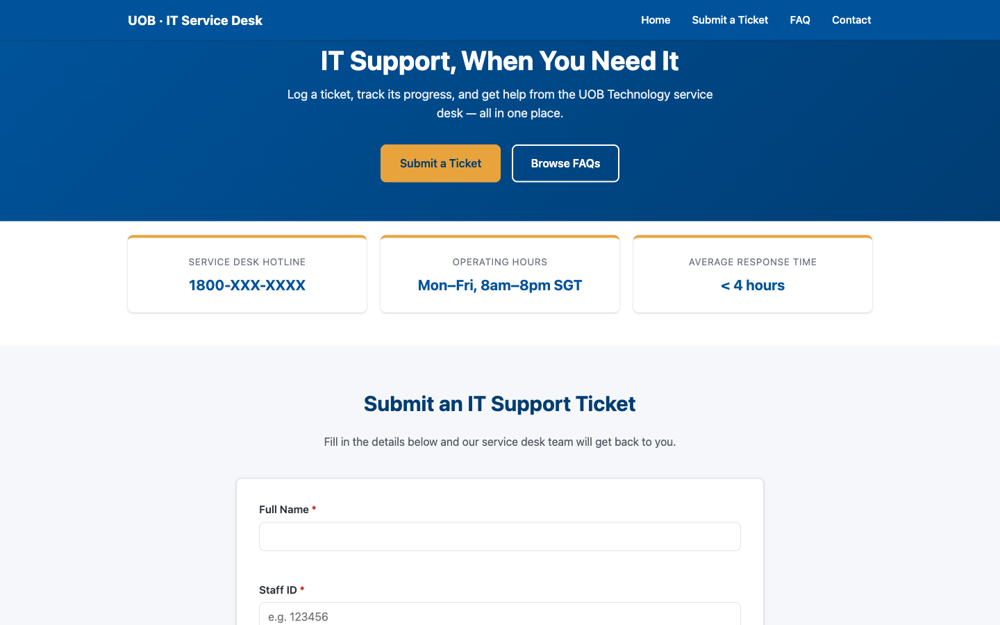
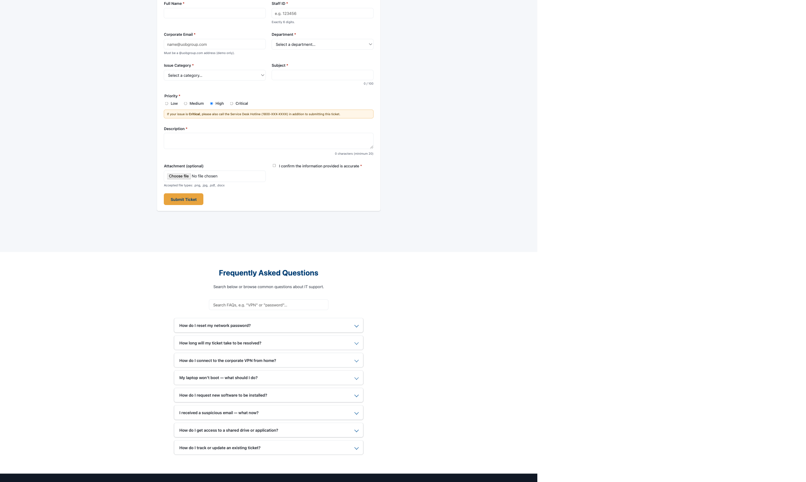
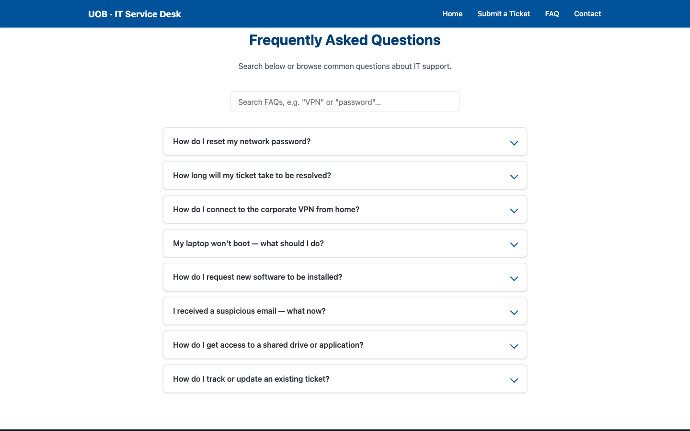
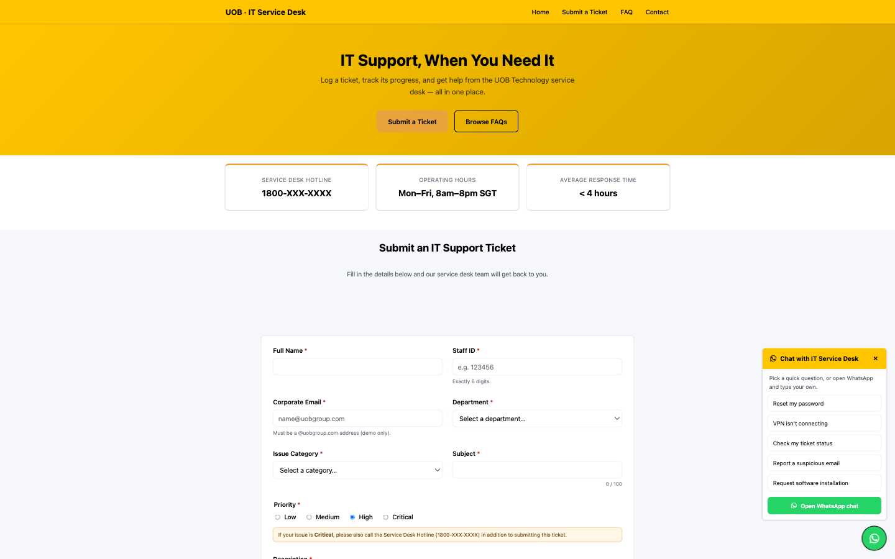

# UOB IT Service Desk — Training Demo

A single self-contained HTML page mocking up an internal "UOB Bank" IT Support Service
Desk: a sticky header/nav, hero banner, an IT support ticket form with client-side
validation, a searchable FAQ accordion, and a footer.

**This is a training/demo mockup only.** It is not affiliated with or endorsed by
United Overseas Bank Limited — see the disclaimer in the page footer.

Live demo: https://venkateshc78-a11y.github.io/itsupport/

## Running it

Everything lives in [index.html](index.html) — no build step, package manager, or
server required. Open the file directly in a browser (double-click it, or run
`open index.html` on macOS).

## What it does

- **Ticket form**: collects name, staff ID, corporate email, department, issue
  category, priority, subject, description, and an optional attachment. Fields are
  validated on blur and on submit, with inline error messages and focus management.
  On a valid submission it generates a mock ticket reference
  (`UOB-ITSD-YYYYMMDD-####`) and shows the expected SLA response time based on
  priority. Submitted tickets are kept in an in-memory array only — nothing is
  persisted to `localStorage`/`sessionStorage`, and nothing is sent over the network.

  
- **Credential warning**: the description field is checked against a pattern that
  flags likely credential leaks (e.g. `password: ...`, `otp is ...`) so users are
  warned never to share passwords, OTPs, or card numbers in a ticket.
- **FAQ**: a live-search box filters 8 accordion-style questions and answers about
  common IT support scenarios (password resets, VPN access, hardware issues, etc.).

  
- **WhatsApp chat widget**: a floating button in the bottom-right corner opens a panel
  of quick-question suggestions (password reset, VPN issue, ticket status, phishing
  report, software request) plus a general "Open WhatsApp chat" link — each one opens
  `wa.me` with a pre-filled message.

  
- **Christmas party RSVP dialog**: a native `<dialog>` modal pops up automatically 10
  seconds after page load, announcing the company Christmas celebration (Hilton Hotel,
  8:00 PM, computed as the next upcoming Wednesday from whenever the page is viewed)
  and collecting name, email, and department. Like the ticket form, RSVPs are kept
  in-memory only — no network call or persistence.

## Testing

[.claude/agents/ticket-form-tester.md](.claude/agents/ticket-form-tester.md) defines a
project-level Claude Code agent that exercises the ticket form end-to-end with the
Playwright MCP tools (fills it with sample data, submits, verifies the success panel
and ticket reference) and writes a JSON record of each run to a git-ignored `logs/`
folder at the project root.

## Structure

All CSS lives in one `<style>` block and all JavaScript in one `<script>` block
inside `index.html`, organized top-to-bottom as: header/nav → hero → quick-info
cards → ticket form → FAQ → footer, with matching section comments in the markup,
styles, and script. See [CLAUDE.md](CLAUDE.md) for more detail on the design tokens
and behavioral specifics (validation rules, ticket reference format, etc.).

## Deployment

The page is deployed to GitHub Pages automatically on every push to `main` via the
GitHub Actions workflow in
[.github/workflows/deploy-pages.yml](.github/workflows/deploy-pages.yml).
